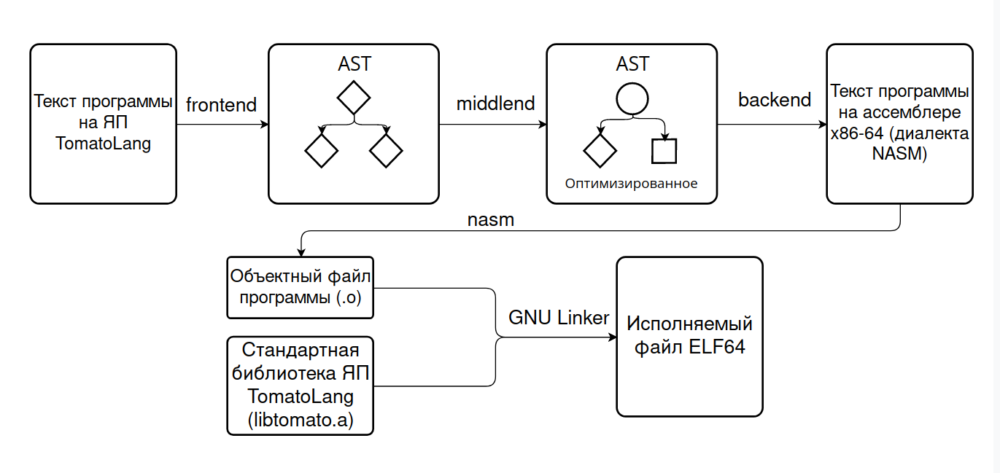
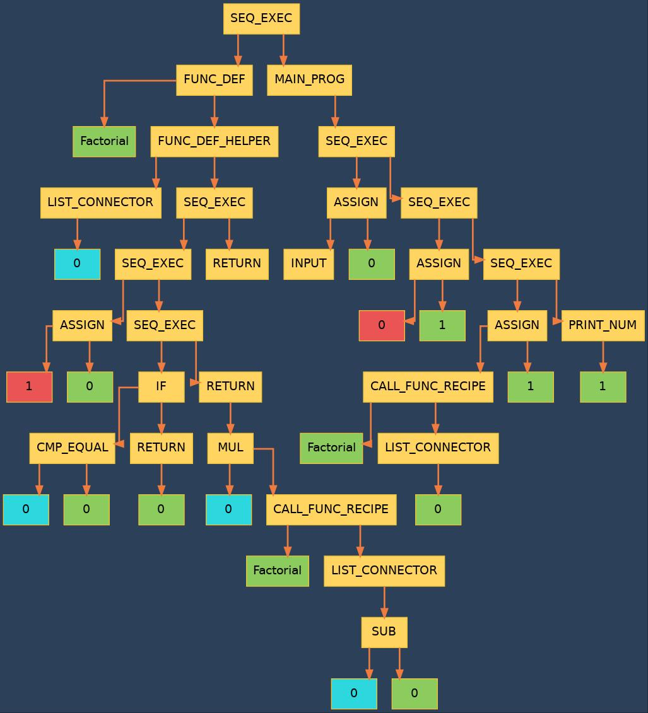
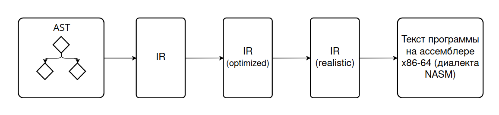

# Язык программирования TomatoLang с ароматом эзотерики и привкусом безумия

<p>
<details>
<summary><b>Содержание</b></summary>

1. [Примеры программ и их наиболее близкие аналоги на языке Си](#примеры-программ-и-их-наиболее-близкие-аналоги-на-языке-си)
    1. [Программа, считающая факториал введённого числа:](#программа,-считающая-факториал-введённого-числа)
    2. [Программа, решающая квадратные уравнения:](#программа,-решающая-квадратные-уравнения)
2. [Схема работы компилятора](#схема-работы-компилятора)
3. [Пример AST для программы "factorial", упомянутой выше.](#пример-ast-для-программы-"factorial",-упомянутой-выше)
4. [Общие особенности ЯП TomatoLang](#общие-особенности-яп-tomatolang)
5. [Frontend](#frontend)
    1. [Грамматика](#грамматика)
        1. [Ключевые слова](#ключевые-слова)
        2. [Разделяющие символы](#разделяющие-символы)
    2. [Особенности грамматики](#особенности-грамматики)
6. [Backend](#backend)
7. [Стандартная библиотека ЯП TomatoLang ](#стандартная-библиотека-яп-tomatolang-)
8. [Сборка и использование](#сборка-и-использование)
    1. [Зависимости](#зависимости)
    2. [Сборка](#сборка)
    3. [Использование компилятора](#использование-компилятора)
9. [Некоторые технические детали](#некоторые-технические-детали)
    1. [Расшифровка обозначений на изображениях AST](#расшифровка-обозначений-на-изображениях-ast)
    2. [Выдержка из формата AST](#выдержка-из-формата-ast)

</details>
</p>


Это учебный проект, представляющий собой компилятор маленького Си-подобного языка программирования. Этот ЯП не преследует цели быть удобным / эффективным / в каком-либо ещё виде "настоящим" ЯП, т.к. иначе он бы имел синтаксис, очень похожий на Си, Python или другой популярный ЯП. Поэтому писать программы на этом языке тяжело, неудобно и не имеет никакого практического смысла! Однако, это не мешает мне, как автору проекта, получить некоторые базовые знания о создании компилятора, а отсутствие необходимости быть строгим позволяет добавить юмора и творчества. 

_Примечание: этот репозиторий представляет собой вторую версию данного языка. Первая версия расположена в другом репозитории [Language](https://github.com/Feanor-19/Language), информация о ней расположена там же._

## Примеры программ и их наиболее близкие аналоги на языке Си

Здесь могло бы быть длинное и довольно неловкое описание идеи языка (что должны напоминать программы, написанные на нём), однако лучше всего за себя будут говорить сами программы, а каждый сам для себя может решить, на что они похожи и в чём заключается идея: 

### Программа, считающая факториал введённого числа:

- TomatoLang

```
The Recipe Of The Most Delicious Dish One Can Ever Imagine!

Here Are Some Skills You Need To Have:

Skill To Cook Factorial Using Mathematicians As Ingredients:
    Quickly Obtain 1 Units Of Math!

    In Case There Happens To Be Just The Same Amount Of Mathematicians
    Comparing With Math Urgently Do The Following Steps:
        There Is No Time To Explain, Use Math As The Result Of This Skill!
    Now, Breathe Out And Continue Whatever You Were Doing!

    There Is No Time To Explain, Use Mathematicians Angrily Fried With Cooked Beforehand
    Factorial (Using Mathematicians Unfortunately Without Math As Ingredients)
    As The Result Of This Skill!

Here Is The Recipe Itself:
Quickly Obtain As Much As The Universe Says Units Of Mathematicians!
Quickly Obtain 0 Units Of Answer!

In Case There Happens To Be Just The Same Amount Of Mathematicians
Comparing With Answer Urgently Do The Following Steps:
    Quickly Obtain 1 Units Of TheOne!
    Place TheOne Right Into Answer!
Otherwise You Should Do A Completely Different Thing:
    Place Cooked Beforehand Factorial (Using Mathematicians As Ingredients) Right Into Answer!
Now, Breathe Out And Continue Whatever You Were Doing!
Serve Answer!

That's All! Don't Forget To Check It On Your Friends Before Tasting Yourself!
```

- Язык C:

```c
#include <stdio.h>

double Factorial( double Mathematicians )
{
    double Math = 1;
    if ( Mathematicians == Math )
    {
        return Math;
    }

    return Mathematicians * Factorial(Mathematicians - Math);
}

int main()
{
    double Mathematicians;
    scanf( "%lf", &Mathematicians );
    double Answer = 0;

    if ( Mathematicians == Answer )
    {
        double TheOne = 1;
        Answer = TheOne;
    }
    else
    {
        Answer = Factorial( Mathematicians );
    }

    printf("%lf\n", Answer);
}
```

### Программа, решающая квадратные уравнения:

- TomatoLang:

```
The Recipe Of The Most Delicious Dish One Can Ever Imagine!

Here Are Some Skills You Need To Have:

Skill To Cook Discriminant Using Apples, Beetroots, Carrots As Ingredients:
    Quickly Obtain 0 Units Of Discr!
    Place Beetroots Angrily Fried With Beetroots Unfortunately Without
    4 Units Of Apples Madly Fried With Carrots Right Into Discr!

    There Is No Time To Explain, Use Discr As The Result Of This Skill!

# ax + b = 0, a != 0 #
Skill To Cook LinearRoot Using Aubergines, Beans As Ingredients:
    Quickly Obtain 0 Units Of Result!
    Place Emotionally Rinsed Beans Thickly Spread On Aubergines Right Into Result!

    There Is No Time To Explain, Use Result As The Result Of This Skill!

# ax + b = 0 #
Skill To Do SolvationOfLinear Using Aubergines, Beans As Ingredients:
    Quickly Obtain 0 Units Of Nothing!
    In Case There Happens To Be Just The Same Amount Of Aubergines
    Comparing With Nothing Urgently Do The Following Steps:
        In Case There Happens To Be Just The Same Amount Of Beans
        Comparing With Nothing Urgently Do The Following Steps:
            Scream In Despair: "Well, there is kinda the whole infinity and a small carriage of roots..."!
        Otherwise You Should Do A Completely Different Thing:
            Scream In Despair: "Quite interesting, that's also not a linear equation."!
            Scream In Despair: "It's not an equation at all: there are simply no roots, even imaginary ones!"!
        Now, Breathe Out And Continue Whatever You Were Doing!
    Otherwise You Should Do A Completely Different Thing:
        Quickly Obtain 0 Units Of Root!
        Place Cooked Beforehand LinearRoot (Using Aubergines, Beans As Ingredients)
        Right Into Root!
        Scream In Despair: "Here is the only linear root:"!
        Serve Root!
    Now, Breathe Out And Continue Whatever You Were Doing!

Skill To Cook QuadraticFirstRoot Using Apples, Beetroots, Dicsr As Ingredients:
    Quickly Obtain 0 Units Of Result!
    Place The Following Prepared Beforehand: Madly Rinsed Beetroots Fiercely
    Mixed With Hastily Peeled Dicsr; Thickly Spread On The Following Prepared Beforehand:
    2 Units Of Apples; Right Into Result!

    There Is No Time To Explain, Use Result As The Result Of This Skill!

Skill To Cook QuadraticNumberOfRoots Using Dicsr As Ingredients:
    Quickly Obtain 0 Units Of Result!
    Quickly Obtain 1 Units Of Neutral!
    Quickly Obtain 0 Units Of Nothing!
    In Case There Happens To Be More Dicsr
    Comparing With Nothing Urgently Do The Following Steps:
        Place 2 Units Of Neutral Right Into Result!
        There Is No Time To Explain, Use Result As The Result Of This Skill!
    Now, Breathe Out And Continue Whatever You Were Doing!

    In Case There Happens To Be Just The Same Amount Of Dicsr
    Comparing With Nothing Urgently Do The Following Steps:
        Place 1 Units Of Neutral Right Into Result!
        There Is No Time To Explain, Use Result As The Result Of This Skill!
    Now, Breathe Out And Continue Whatever You Were Doing!

    In Case There Happens To Be Less Dicsr
    Comparing With Nothing Urgently Do The Following Steps:
        Place 0 Units Of Neutral Right Into Result!
        There Is No Time To Explain, Use Result As The Result Of This Skill!
    Now, Breathe Out And Continue Whatever You Were Doing!

# ax^2 + bx + c = 0 #
Skill To Do SolvationOfQuadratic Using Apples, Beetroots, Carrots As Ingredients:
    Quickly Obtain 0 Units Of Nothing!
    Quickly Obtain 1 Units Of Neutral!
    In Case There Happens To Be Just The Same Amount Of Apples
    Comparing With Nothing Urgently Do The Following Steps:
        Scream In Despair: "Well, that's not quite a quadratic equation, "!
        Scream In Despair: "smells more like a linear one. Anyway..."!
        Perform SolvationOfLinear (Using Beetroots, Carrots As Ingredients)!
    Otherwise You Should Do A Completely Different Thing:
        Quickly Obtain 0 Units Of Discr!
        Place Cooked Beforehand Discriminant (Using Apples, Beetroots, Carrots As Ingredients)
        Right Into Discr!
        Scream In Despair: "Here is the discriminant of your equation:"!
        Serve Discr!

        Quickly Obtain 0 Units Of NumOfRoots!
        Place Cooked Beforehand QuadraticNumberOfRoots (Using Discr As Ingredients)
        Right Into NumOfRoots!
        Scream In Despair: "The number of roots is:"!
        Serve NumOfRoots!

        In Case There Happens To Be Just The Same Amount Of NumOfRoots
        Comparing With Nothing Urgently Do The Following Steps:
            Scream In Despair: "No real roots!"!
        Otherwise You Should Do A Completely Different Thing:
            Quickly Obtain 0 Units Of FirstRoot!
            Place Cooked Beforehand QuadraticFirstRoot (Using Apples, Beetroots, Discr As Ingredients)
            Right Into FirstRoot!
            Scream In Despair: "Aaaand here is the first root:"!
            Serve FirstRoot!

            In Case There Happens To Be Just The Same Amount Of NumOfRoots
            Comparing With 2 Units Of Neutral Urgently Do The Following Steps:
                Quickly Obtain 0 Units Of SecondRoot!
                Place Angrily Rinsed Beetroots Hastily Spread On Apples Unfortunately
                Without FirstRoot Right Into SecondRoot!
                Scream In Despair: "And the second root is:"!
                Serve SecondRoot!
            Now, Breathe Out And Continue Whatever You Were Doing!
        Now, Breathe Out And Continue Whatever You Were Doing!
    Now, Breathe Out And Continue Whatever You Were Doing!

Here Is The Recipe Itself:

Quickly Obtain 1 Units Of Neutral!
Quickly Obtain 0 Units Of Nothing!

Scream In Despair: "Hi, I can solve quadratic equations, like ax^2 + bx + c = 0!"!
Scream In Despair: "Do you want to make a try? [1/0]"!

Quickly Obtain As Much As The Universe Says Units Of Ans!
As Long As There Happens To Be Not The Same Amount Of Ans Comparing With
Nothing Repeat The Following:
    Scream In Despair: "Please, enter coefficient a:"!
    Quickly Obtain As Much As The Universe Says Units Of Apples!

    Scream In Despair: "Please, enter coefficient b:"!
    Quickly Obtain As Much As The Universe Says Units Of Beetroots!

    Scream In Despair: "Please, enter coefficient c:"!
    Quickly Obtain As Much As The Universe Says Units Of Carrots!

    Scream In Despair: "Here are the entered coefficients:"!
    Serve Apples!
    Serve Beetroots!
    Serve Carrots!

    Perform SolvationOfQuadratic (Using Apples, Beetroots, Carrots As Ingredients)!

    Scream In Despair: "Done! Do you want to solve another equation? [1/0]"!
    Place As Much As The Universe Says Units Of Neutral Right Into Ans!

    Throw Away Apples!
    Throw Away Beetroots!
    Throw Away Carrots!
Repeat Until Ready And Then Go Further!

Scream In Despair: "Goodbye!"!

That's All! Don't Forget To Check It On Your Friends Before Tasting Yourself!
```

- Язык C:

```c
#include <stdio.h>
#include <math.h>

double Discriminant( double Apples, double Beetroots, double Carrots )
{
    double Discr = 0;
    Discr = Beetroots*Beetroots - 4 * Apples*Carrots;

    return Discr;
}

// ax + b = 0, a != 0
double LinearRoot( double Aubergines, double Beans )
{
    double Result = 0;
    Result = -Beans / Aubergines;
    return Result;
}

// ax + b = 0
void SolvationOfLinear( double Aubergines, double Beans )
{
    double Nothing = 0;
    if ( Aubergines == 0 )
    {
        if ( Beans == 0)
        {
            printf( "Well, there is kinda the whole infinity and a small carriage of roots...\n" );
        }
        else
        {
            printf( "Quite interesting, that's also not a linear equation. It's not an "
                    "equation at all: there are simply no roots, even imaginary ones!\n" );
        }
    }
    else
    {
        double root = LinearRoot( Aubergines, Beans );

        printf( "Here is the only linear root:\n" );
        printf( "%lf\n", root );
    }
}

//! ax^2 + bx + c = 0, a != 0
double QuadraticFirstRoot( double Apples, double Beetroots, double Dicsr)
{
    double Result = 0;
    Result = (-Beetroots + sqrt( Dicsr ) ) / (2 * Apples);

    return Result;
}

double QuadraticNumberOfRoots( double Dicsr )
{
    double Result = 0;
    double Neutral = 1;
    double Nothing = 0;
    if ( Dicsr > 0 )
    {
        Result = 2*Neutral;
        return Result;
    }

    if ( Dicsr == 0 )
    {
        Result = 1*Neutral;
        return Result;
    }

    if ( Dicsr < 0 )
    {
        Result = 0;
        return Result;
    }
}

// ax^2 + bx + c = 0
void SolvationOfQuadratic( double Apples, double Beetroots, double Carrots )
{
    double Nothing = 0;
    double Neutral = 1;
    if ( Apples == 0)
    {
        printf( "Well, that's not quite a quadratic equation, "
                "smells more like a linear one. Anyway...\n" );

        SolvationOfLinear( Beetroots, Carrots );
    }
    else
    {
        double Discr = Discriminant( Apples, Beetroots, Carrots );
        printf( "Here is the discriminant of your equation:\n" );
        printf( "%lf\n", Discr );

        double NumOfRoots = QuadraticNumberOfRoots( Discr );
        printf( "The number of roots is:\n" );
        printf( "%lf\n", NumOfRoots );

        if ( NumOfRoots == 0)
        {
            printf( "No real roots!\n" );
        }
        else
        {
            double FirstRoot = 0;
            FirstRoot = QuadraticFirstRoot( Apples, Beetroots, Discr );

            printf( "Aaaand here is the first root:\n" );
            printf( "%lf\n", FirstRoot );

            if ( NumOfRoots == 2 )
            {
                double SecondRoot = 0;
                SecondRoot = -Beetroots / Apples - FirstRoot;
                printf( "And the second root is:\n" );
                printf( "%lf\n", SecondRoot );
            }
        }
    }
}

int main()
{
    double Neutral = 1;
    double Nothing = 0;

    printf( "Hi, I can solve quadratic equations, like ax^2 + bx + c = 0! "
            "Do you want to make a try? [1/0]\n" );

    double Ans = 0;
    scanf( "%lf", &Ans );

    while ( Ans != Nothing )
    {
        printf( "Please, enter coefficient a:\n" );
        double Apples = 0;
        scanf( "%lf", &Apples );

        printf( "Please, enter coefficient b:\n" );
        double Beetroots = 0;
        scanf( "%lf", &Beetroots );

        printf( "Please, enter coefficient c:\n" );
        double Carrots = 0;
        scanf( "%lf", &Carrots );

        printf( "Here are the entered coefficients:\n" );
        printf("%lf\n", Apples);
        printf("%lf\n", Beetroots);
        printf("%lf\n", Carrots);

        SolvationOfQuadratic( Apples, Beetroots, Carrots );

        printf( "Done! Do you want to solve another equation? [1/0]\n" );
        
        double tmp;
        scanf( "%lf", &tmp );
        Ans = tmp * Neutral;
    }

    printf( "Goodbye!\n" );
}
```

Дальше будут рассмотрены все составляющие компилятора и ЯП TomatoLang.

## Схема работы компилятора



1. `Frontend` принимает на вход текстовый файл с программой на ЯП `TomatoLang` и с помощью алгоритма рекурсивного спуска преобразовывает её в `абстрактное синтаксическое дерево (AST)`. _(Примечание: внутри программы по историческим причинам AST иногда называется "compiler tree")_
2. `Middlend` применяет оптимизации к AST, как-либо преобразовывая его. На данный момент единственной оптимизацией является (самая простая из возможных) свёртка констант.
3. `Backend` преобразовывает `AST` в текстовый файл, являющийся `ассемблерным кодом` x86-64 на диалекте `NASM`. _(Подробнее [см. ниже](#bacWkend))_
4. Вызывается установленный ассемблер `NASM`, который преобразовывает `ассебмлерный код` в `объектный файл`.
5. Вызывается установленный `GNU Linker (ld)`, на вход которому даётся `объектный файл` программы и `стандартная библиотека` ЯП TomatoLang (`libtomato.a`). На выходе получается `исполняемый файл ELF64`.

Ниже будут рассмотрены подробнее некоторые составляющие.

## Пример AST для программы "factorial", упомянутой выше.



[Как получить](#использование-компилятора) такую картинку и [расшифровку](#расшифровка-обозначений-на-изображениях-ast) используемых цветовых обозначений см. ниже.

## Общие особенности ЯП TomatoLang

Следующие факты не относятся напрямую к какой-либо из частей компилятора, а потому вынесены сюда:

1. Единственный тип данных: число с плавающей запятой. В `Backend` аналогично типу данных `double` из языка Си.
2. Есть константные строки, но они не являются отдельным типом данных, а только как часть оператора "печать строки".

## Frontend

Для начала рассмотрим грамматику ([ниже](#особенности-грамматики) будут объяснены некоторые особенности):

### Грамматика

Используемые обозначения:

1. Терминалы и ключевые слова заключены в `""`, нетерминалы пишутся без.
2. `+` означает `один или больше`.
3. `*` означает `ноль или больше`.
4. `?...?` означает некоторый `особый случай` (кратко описанный там же).
5. `<...>` означает что-то связанное с `контекстом`.
6. `{...}` означает что-то `необязательное` (технически, `ноль или один`).
7. `(...)` используетя для обозначения группы терминалов и нетерминалов.
8. `|` означает выбор `ИЛИ`.

```py
Prog            ::= "ProgStart" { FuncDefs } Operators "ProgEnd"
FuncDefs        ::= "FuncDefsStart" FuncDef+ "FuncDefsEnd"
FuncDef         ::= FuncRecipe | FuncAction
FuncRecipe      ::= "FuncRecipeHeader" Id {"Using" FormalArgs "AsIngr"} "Colon" Operators
FuncAction      ::= "FuncActionHeader" Id {"Using" FormalArgs "AsIngr"} "Colon" Operators
FormalArgs      ::= Id<Var> ( "Comma" Id<Var> )*
FactArgs        ::= Expr ( "Comma" Expr )*
Operators       ::= Op+
Op              ::= VarBirth | VarDeath | Assign | If | While | Return<in FuncRecipe> | CallFuncAction | PrintNum | PrintStr
PrintStr        ::= "PrintStr" ?string in quotes? "Dot"
PrintNum        ::= "PrintNum" Id<Var> "Dot"
Return          ::= "Return1" Expr "Return2"
VarBirth        ::= "VarBirthOp" Num "UnitsOf" Id "Dot"
VarDeath        ::= "VarDeathOp" Id<Var> "Dot"
Assign          ::= "Asgn1" Expr "Asgn2" Id<Var> "Dot"
Expr            ::= Mulive ( ?Amp (group)? ("OpAdd" | "OpSub") Mulive )*
Mulive          ::= Unr ( ?Amp (group)? ( "OpMul" | "OpDiv" ) Unr )*
Unr             ::= ( ?Amp (group)? ?UnrOp (group)? Ingr ) | Ingr
Ingr            ::= ( Num "UnitsOf" Primal ) | Primal
Primal          ::= ("InBracketsStart" Expr "Semicolon") | CallFuncRecipe | Id<Var>
Id              ::= ['a'-'z','A'-'Z']['a'-'z','A'-'Z','_','0'-'9']*
Num             ::= ( "InputOp" ) | ( ?float number? )
If              ::= "If1" "Cond" ?CmpOp (group)? Expr "CmpWith" Expr "If2" Operators { "Else" Operators } "IfEnd"
While           ::= "While1" "Cond" ?CmpOp (group)? Expr "CmpWith" Expr "While2" Operators "WhileEnd"
CallFuncRecipe  ::= "CallFuncRecipe" Id<func> {"BracketOpn" "Using" FactArgs "AsIngr" "BracketCls"}
CallFuncAction  ::= "CallFuncAction" Id<func> {"BracketOpn" "Using" FactArgs "AsIngr" "BracketCls"} "Dot"
```

#### Ключевые слова

|Обозначение в грамматике|Написание в тексте программы|Комментарий|
|-|-|-|
|Amp_1|Angrily|Первый элемент группы [амлификаторов](#особенности-грамматики)|
|Amp_2|Unfortunately|
|Amp_3|Madly|
|Amp_4|Thickly|
|Amp_5|Rapidly|
|Amp_6|Hastily|
|Amp_7|Emotionally|
|Amp_8|Desperately|
|Amp_9|Fiercely|
|Amp_10|Fanatically|
|AsIngr|As Ingredients|
|Asgn1|Place|
|Asgn2|Right Into|
|CallFuncAction|Perform|
|CallFuncRecipe|Cooked Beforehand|
|CmpOp_equal|Just The Same Amount Of|Первый элемент группы операторов сравнения|
|CmpOp_lessOrEqual|The Same Amount Or Less Of|
|CmpOp_less|Less|
|CmpOp_moreOrEqual|The Same Amount Or More Of|
|CmpOp_more|More|
|CmpOp_notEqual|Not The Same Amount Of|
|CmpWith|Comparing With|
|Cond|There Happens To Be|
|Else|Otherwise You Should Do A Completely Different Thing:|
|FuncActionHeader|Skill To Do|
|FuncDefsEnd|Here Is The Recipe Itself:|
|FuncDefsStart|Here Are Some Skills You Need To Have:|
|FuncRecipeHeader|Skill To Cook|
|If1|In Case|
|If2|Urgently Do The Following Steps:|
|IfEnd|Now, Breathe Out And Continue Whatever You Were Doing!|
|InBracketsStart|The Following Prepared Beforehand:|
|InputOp|As Much As The Universe Says|
|OpAdd|Mixed With|
|OpDiv|Spread On|
|OpMul|Fried With|
|OpSub|Without|
|PrintNum|Serve|
|PrintStr|Scream In Despair:|
|ProgEnd|That's All! Don't Forget To Check It On Your Friends Before Tasting Yourself!|
|ProgStart|The Recipe Of The Most Delicious Dish One Can Ever Imagine!|
|Return1|There Is No Time To Explain, Use|
|Return2|As The Result Of This Skill!|
|UnitsOf|Units Of|
|UnrOp_minus|Rinsed|Первый элемент группы унарных арифметических операторов|
|UnrOp_sqrt|Peeled|
|Using|Using|
|VarBirthOp|Quickly Obtain|
|VarDeathOp|Throw Away|
|While1|As Long As|
|While2|Repeat The Following:|
|WhileEnd|Repeat Until Ready And Then Go Further!|

<!-- TODO - идея для continue: "закроем глаза на то, что в этой итерации ты схалтурил. Просто переходи к следующей, но не забывай, что Большой Брат следит за тобой." -->
<!-- TODO - идея для break:    "давай будем честны, тебе это надоело. Просто бросай все эти повторения и не возвращайся к ним больше, иди дальше." -->

#### Разделяющие символы

|Обозначение в грамматике|Написание в тексте программы|
|-|-|
|Dot|!|
|Semicolon|;|
|Colon|:|
|Comma|,|
|BracketOpn|(|
|BracketCls|)|

### Особенности грамматики

- Как было сказано в самом начале, на ЯП TomatoLang `ужасно неудобно писать программы`. 
- Переносы строки и пробелы не играют роли, но помогают хоть как-то структурировать текст программы.
- Ключевые слова очень длинные, некоторые представляют собой целые предложения (а иногда даже несколько), но благодаря этому достигается `эффект единого текста`, пускай и напоминающего бред сумасшедшего.
- В некоторых местах обязательными являются так называемые `амплификаторы` (_любой*_ из 10 вариантов), придающие тексту экспрессивности. _*Не допускается тавтология! Использование одного и того же амплификатора подряд приводит к ошибке компиляции ~~(и двойке за эссе по английскому)~~._
- Числовые константы разрешены в очень ограниченном числе мест, а так же отсутствует возможность использования констант вместе с переменными в выражениях. Причина в том, что переменные в данном ЯП представляют собой ингредиенты и блюда, арифметические операции - некоторые варианты готовки; нельзя ведь "пожарить мясо с числом 19"! **Однако**, допускается умножение константы на переменную слева, вида `4 Units Of Apples`.
- Всё, заключенное в символы `#`, является комментарием. 

## Backend



Получаемое на вход `AST` `Backend` сначала преобразовывает в `IR` (Intermediate Representation, промежуточное представление). `IR` представляет собой линейную последовательность (двусвязный список) инструкций, практически идентичных инструкциям архитектуры x86-64, за исключением некоторых "нереалистичных" особенностей. Такой подход (в отличие от прямой трансляции сразу в текст NASM) позволяет легко и понятно производить оптимизации, после которых `IR` приводится к "реалистичному" виду, а затем и в финальный ассебмлерный текст.

На данный момент единственной "нереалистичной" особенностью `IR` является наличие у инструкций `push` и `pop` возможности взаимодействовать с xmm регистрами, что не является самым оптимальным решением (например, можно было бы объединить инструкции `add` - `addsd`, `sub` - `subsd` в одну по схожему принципу).

Данная "нереалистичность" позволяет применять оптимизацию, заключающуюся в свёртке последовательных `push` и `pop` в один `mov`. Т.к. `Backend` работает по принципу `стековой арифметики`, такая конструкция при трансляции больших выражений встречается очень часто. На данный момент это единственная оптимизация, но добавление новых не должно оказаться затруднительным.

## Стандартная библиотека ЯП TomatoLang 

Расположена в `tomato_stdlib`, частично написана на ассемблере, частично на Си. Не использует стандартную библиотеку Си ценой очень простых и скудных реализаций функций печати и ввода числа (что, впрочем, под стать духу языка). Реализованы следующие основные функции:

- `print_str` - печать константной строки в `stdout`.
- `print_num` - печать числа с плавающей запятой в `stdout`.
- `input`     - ввод числа с плавающей запятой из `stdin`.
- `_exit`     - завершение программы, обёртка над соответствующим syscall.

Все остальные функции, которые можно найти в исходниках, являются вспомогательными.

**Необычная особенность `print_num`**: в случае наличия в вводе чего-то, что не получается интерпретировать как число, не возвращает ошибку (т.к. не заложен такой функционал), но печатает сообщение об ошибке с предупреждением о последующем `Undefined Behaviour`.

## Сборка и использование

### Зависимости

- Используется собственная библиотека бинарного дерева [tree](https://github.com/Feanor-19/tree). Инструкция по установке описана по ссылке.

- [NASM](https://www.nasm.us/). Должен быть установлен и доступен из терминала.

- GNU linker (ld). Должен быть установлен и доступен из терминала.

- Используется [graphviz dot](https://graphviz.org/download/) для создания изображений AST. Должен быть установлен и доступен из терминала.


### Сборка

- Сборка всех частей компилятора:
```
make
```

- Доступна возможность сборки в отдельности каждой из частей компилятора (`front`, `middle`, `back`, `stdlib`)
```
make *название части*
```

### Использование компилятора

**С помощью Makefile, вызывающего с нужными аргументами все составляющие компилятора**:

```
make tomato PROG_DIR=*имя папки c программой, см. ниже* [IMG_DIR=*имя папки для картинки AST*]
```
- PROG_DIR: текст программы должен быть в данной папке в файле `prog.txt`. В этой же папке будут создаваться все промежуточные файлы и финальный исполняемый файл `prog`.
- IMG_DIR: имя директории, в которой появится картинка AST, созданная с помощью инструмента `graphviz dot`. Конечно, требует `graphviz dot` доступный из терминала.

Запуск полученного исполняемого файла:
```
make cook PROG_DIR=*имя папки c программой*
```

**Самостоятельно**:

Каждая из частей может быть использована по отдельности. В директориях `bin` лежат исполнямые файлы (`frontend`, `middleend`, `backend`). У всех одинаковые доступные флаги:

1. `-h` - печатает "Помощь" и завершает программу.
2. `-i` - указание входного файла.
3. `-o` - указание выходного файла.
4. `-l` - указание файла для логов (в ином случае использует `stdout`).
5. `--img-dumps` - если указан, создаёт картинку AST с помощью `graphviz dot` в указанной после флага директории.

## Некоторые технические детали

### Расшифровка обозначений на изображениях AST

Для наглядности приведём изображение небольшого AST ещё раз, полученного из программы [factorial](#программа-считающая-факториал-введённого-числа):


|Цвет|Обозначение|
|-|-|
|Жёлтый|Операторы [полный список, использующийся для кодогенерации](./common/src/ast_ops_defs.h)|
|Зелёный|Идентификаторы, включая два типа: строковые (имена функций) и числовые (индексы локальных переменных)|
|Голубой|Идентификаторы (числовые) формальных аргументов|
|Красный|Константы, включая числовые и строковые|

### Выдержка из формата AST

1. Данные, хранящиеся в узле AST:

```c
struct TreeNodeData
{
    TreeNodeType type;
    union
    {
        ASTOpNameEnum op;
        num_t num;
        ident_t id;
        char *str;
        size_t num_of_loc_vars;
    };

};
```

2. Типы узлов определяются следующим перечислением:

```c
enum TreeNodeType
{
    TREE_NODE_TYPE_OP,        //!< AST Operator
    TREE_NODE_TYPE_CONST_NUM, //!< Constant number of type 'num_t'
    TREE_NODE_TYPE_VAR_LOCAL, //!< Local variable in some func, defined by numerical
                              // id (of type 'ident_t')
    TREE_NODE_TYPE_FUNC_ARG,  //!< One of func args, defined by its sequence number
                              // (of type 'ident_t')
    TREE_NODE_TYPE_STR_IDENT, //!< Contains string identificator (used for functions' names).
    TREE_NODE_TYPE_CONST_STR, //!< Constant string.
    TREE_NODE_TYPE_FUNC_INFO, //!< Stores number of local vars of the func.
};
```

_Примечание: только узлы типа "OP" (оператор) могут иметь потомков, остальные являются листьями._ 

3. Все поддерживамые операторы (ASTOp):

|Имя оператора|Описание|Требования
|-|-|-|
|DUMMY|Фиктивный оператор|
|SEQ_EXEC|Оператор последовательного исполнения|Левое поддерево - операторы, которые должны выполниться первее, правое поддерево - позднее
|FUNC_DEF|Определение функции|Левым и правым потомком должны быть FUNC_DEF_HELPER
|FUNC_DEF_HELPER|Часть определения функции, назначение зависит от положения (левый или правый потомок FUNC_DEF)|Если левый потомок: слева STR_IDENT с именем функции, справа FUNC_INFO; если правый потомок: слева список аргументов (см. LIST_CONNECTOR), справа тело функции
|LIST_CONNECTOR|Соединитель списков|Левый потомок - элемент списка, правый потомок - LIST_CONNECTOR, если данный элемент списка не последний, иначе отсутствует
|MAIN_PROG|Определение функции main|Левый потомок - количество локальных переменных, правый потомок - тело main.
|ASSIGN|Присваивание|Левый потомок - выражение, правый потомок - VAR_LOCAL ИЛИ FUNC_ARG
|CMP_MORE|Группа операторов сравнения CMP_*|Оба потомка - выражения для сравнения
|CMP_LESS||
|CMP_MORE_EQ||
|CMP_LESS_EQ||
|CMP_EQUAL||
|CMP_NOT_EQ||
|ADD|Стековое сложение|
|SUB|Стековое вычитание|
|MUL|Стековое умножение|
|DIV|Стековое деление|
|IF|Условие|Левый потомок - CMP_*, правый потомок - тело if (операторы) ИЛИ ELSE
|WHILE|Цикл while|Левый потомок - CMP_*, правый потомок - тело while (операторы)
|ELSE|Используется в IF, если есть ветка "иначе"|Левый потомок - основное тело, правый потомок - тело "иначе"
|SQRT|Квадратный корень|Правый потомок - выражение
|MINUS|Унарный минус|Правый потомок - выражение
|CALL_FUNC_RECIPE|Вызов функции типа "RECIPE"|Левый потомок - STR_IDENT с именем функции, правый потомок - список фактических аргументов-выражений (см. LIST_CONNECTOR)
|CALL_FUNC_ACTION|Вызов функции типа "ACTION"|см. CALL_FUNC_RECIPE
|RETURN|return|Если внутри функции типа "RECIPE", то правый потомок - выражение, иначе (внутри функции типа "ACTION") - оба потомка пустые
|INPUT|Ввод числа|Нет потомков
|PRINT_NUM|Печать числа|Правый потомок - VAR_LOCAL ИЛИ FUNC_ARG
|PRINT_STR|Печать строки|Правый потомок - CONST_STR
